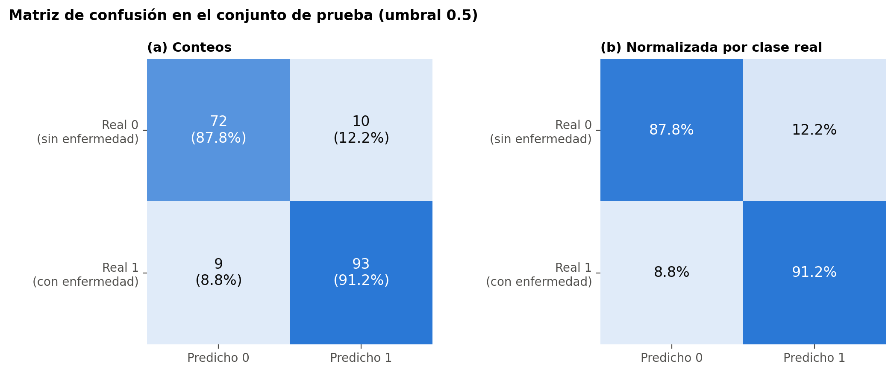
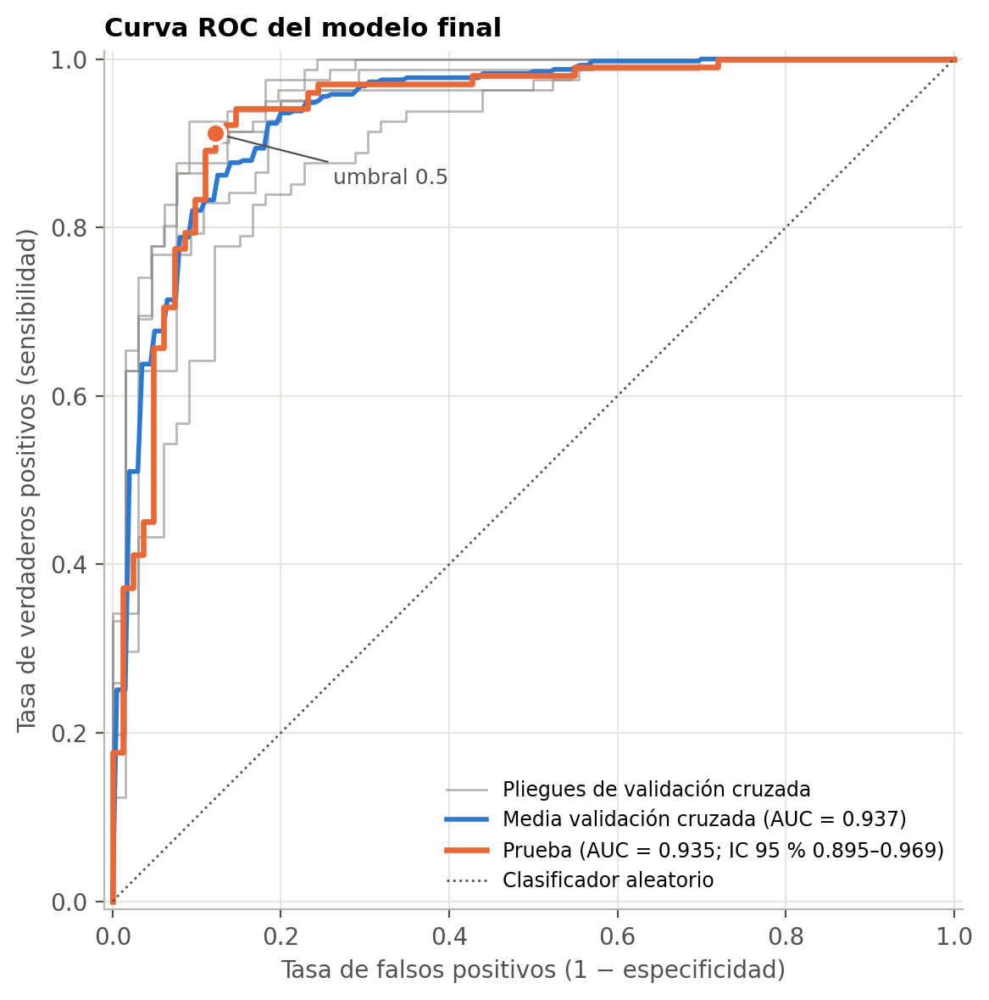

# Predicción de falla cardíaca — MLOps local con Pipelines, FastAPI, Docker, Kubernetes, GitHub Actions y Evidently

[](https://github.com/SantiagomezaC/heart-disease-mlops/actions/workflows/ci.yml)

**Autores:** Manuel Meza · Kevin Clemente
**Curso:** Machine Learning (maestría), Prof. Dr. Lihki Rubio. Proyecto integrador del capítulo 10, [*Pipelines*](https://lihkir.github.io/MachineLearning/chains_pipelines.html#proyecto-integrador-de-aprendizaje-automatico)

---

## Resumen

El proyecto implementa de extremo a extremo el ciclo de vida de un clasificador binario que estima el riesgo de enfermedad cardíaca (`HeartDisease = 1`) a partir de 11 variables clínicas del conjunto *Heart Failure Prediction* (918 pacientes). El preprocesamiento (imputación de ceros clínicos con indicador de ausencia, escalado MinMax y codificación one-hot) y el clasificador se encapsulan en un único `Pipeline` optimizado con `GridSearchCV` y validación cruzada estratificada. Se demuestra empíricamente el efecto de la fuga de datos y se comparan nueve clasificadores del curso. El modelo seleccionado (XGBoost) alcanza en el conjunto de prueba **AUC = 0.935** (IC 95 %: 0.895–0.969), **exactitud = 0.897**, sensibilidad de 0.912 y especificidad de 0.878. El modelo se sirve con FastAPI, se empaqueta con Docker, se despliega en Kubernetes, se verifica automáticamente en cada *push* con GitHub Actions y se vigila con reportes de deriva de Evidently.

| Etapa | Entregable | Ubicación |
|---|---|---|
| 0. Estructura | Repositorio modular | este repositorio |
| 1. EDA, preprocesamiento y *data leakage* | Cuaderno tipo artículo | [`notebooks/1_model_leakage_demo.ipynb`](notebooks/1_model_leakage_demo.ipynb) |
| 2. Entrenamiento seguro | Cuaderno tipo artículo + modelo | [`notebooks/2_model_pipeline_cv.ipynb`](notebooks/2_model_pipeline_cv.ipynb), [`model.joblib`](model.joblib) |
| 3. FastAPI + Docker | API REST e imagen | [`app/api.py`](app/api.py), [`docker/`](docker/) |
| 4. Kubernetes | Deployment y Service | [`k8s/`](k8s/) |
| 5. Integración continua | Workflow con lint, pruebas, imagen y despliegue en kind | [`.github/workflows/ci.yml`](.github/workflows/ci.yml), [`tests/`](tests/) |
| 6. Monitoreo | Reportes de deriva | [`drift_report.html`](drift_report.html), [`notebooks/3_drift_monitoring.ipynb`](notebooks/3_drift_monitoring.ipynb) |

## Estructura del repositorio

```
heart-disease-mlops/
├── app/
│   ├── api.py                      # API FastAPI (Etapa 3)
│   ├── model.joblib                # pipeline serializado que carga la API
│   └── model_metadata.json         # métricas, hiperparámetros y versiones
├── docker/
│   ├── Dockerfile
│   └── requirements.txt            # dependencias fijadas de la imagen
├── k8s/
│   ├── deployment.yaml
│   └── service.yaml
├── notebooks/
│   ├── 1_model_leakage_demo.ipynb  # Etapa 1
│   ├── 2_model_pipeline_cv.ipynb   # Etapa 2
│   ├── 3_drift_monitoring.ipynb    # Etapa 6 (análisis)
│   └── ml_utils.py                 # funciones reutilizables de entrenamiento y evaluación
├── .github/
│   └── workflows/
│       └── ci.yml                  # Etapa 5
├── monitoring/
│   ├── drift_report.py             # Etapa 6 (script reproducible)
│   └── requirements.txt
├── tests/
│   ├── test_api.py                 # pruebas funcionales de la API
│   └── test_model.py               # umbrales mínimos de desempeño del modelo
├── data/
│   ├── heart.csv                   # dataset original (Kaggle)
│   ├── reference.csv               # entrenamiento + predicciones (referencia de deriva)
│   └── current.csv                 # prueba + predicciones (datos actuales)
├── reports/
│   ├── figures/                    # figuras de los cuadernos
│   ├── evidence/                   # salidas de lint, pruebas, API, Docker y Kubernetes
│   ├── drift_report_simulated.html
│   ├── drift_summary.json
│   └── html/                       # cuadernos exportados a HTML para lectura directa
├── scripts/
│   ├── deploy_local.ps1            # Etapas 3 y 4 en un solo paso (Docker + Minikube)
│   └── publish_github.ps1
├── drift_report.html               # reporte de deriva entrenamiento vs. prueba
├── model.joblib                    # copia del modelo en la raíz (estructura de la Etapa 0)
├── requirements-dev.txt            # entorno de desarrollo (cuadernos)
└── README.md
```

La estructura reproduce la propuesta de la Etapa 0. Se añadieron `tests/` (exigida por el `pytest tests/` del workflow del enunciado), `monitoring/`, `data/`, `reports/` y `scripts/` para separar el monitoreo, los datos, los resultados y la automatización.

## Resultados principales

**Fuga de datos (Etapa 1).** La variable artificial `leaky_feature` del enunciado produce un AUC de 1.000 tanto en el flujo con fuga como dentro del `Pipeline`: la encapsulación evita la fuga de preprocesamiento, pero no la fuga de objetivo, que se detecta con una auditoría de AUC univariado (`leaky_feature` = 1.000 frente a 0.82 del mejor predictor legítimo). Sin esa variable, ajustar el preprocesamiento no supervisado con todos los datos sesga el AUC en menos de 10⁻⁴ (50 particiones), mientras que la selección de variables antes de la validación cruzada fabrica un AUC de 0.707 sobre etiquetas permutadas, frente a 0.521 del flujo correcto.

**Comparación de modelos (Etapa 1).** Ranking por AUC de validación cruzada (5 pliegues estratificados):

| # | Modelo | AUC CV | AUC prueba | Accuracy prueba |
|---|---|---|---|---|
| 1 | XGBoost | 0.939 ± 0.024 | 0.935 | 0.897 |
| 2 | Random Forest | 0.934 ± 0.026 | 0.930 | 0.880 |
| 3 | Gradient Boosting | 0.934 ± 0.022 | 0.932 | 0.908 |
| 4 | k-NN | 0.930 ± 0.032 | 0.939 | 0.908 |
| 5 | PCA + SVC (RBF) | 0.929 ± 0.035 | 0.934 | 0.875 |
| 6 | Regresión logística | 0.929 ± 0.037 | 0.927 | 0.880 |
| 7 | Naive Bayes gaussiano | 0.928 ± 0.035 | 0.927 | 0.886 |
| 8 | SVC (RBF) | 0.928 ± 0.036 | 0.935 | 0.880 |
| 9 | Árbol de decisión | 0.910 ± 0.028 | 0.887 | 0.777 |

**Modelo final (Etapa 2).** Una búsqueda conjunta sobre las nueve familias (652 configuraciones) selecciona XGBoost con 100 árboles de profundidad 4, tasa de aprendizaje 0.05 y `colsample_bytree` = 0.5.

<p align="center">
  
  
</p>

**Monitoreo (Etapa 6).** Entre entrenamiento y prueba no hay deriva del conjunto (1 de 12 columnas, una falsa alarma que desaparece con corrección de Bonferroni). En un lote de producción simulado (pacientes geriátricos, más colesteroles no reportados) Evidently detecta deriva en 6 de 12 columnas, sin que cambie la distribución de las predicciones.

## Reproducción

### 1. Entorno

```bash
conda create -n heart-mlops python=3.10 -y
conda activate heart-mlops
pip install -r requirements-dev.txt
python -m ipykernel install --user --name heart-mlops
```

El dataset se descarga de [Kaggle](https://www.kaggle.com/datasets/fedesoriano/heart-failure-prediction) y ya está incluido en `data/heart.csv`.

### 2. Cuadernos (Etapas 1, 2 y 6)

Ejecutar en orden `notebooks/1_model_leakage_demo.ipynb`, `notebooks/2_model_pipeline_cv.ipynb` (exporta `app/model.joblib`, `model.joblib`, `app/model_metadata.json` y los conjuntos de `data/`) y `notebooks/3_drift_monitoring.ipynb`. Todo es determinista (`random_state = 42`). Desde la terminal:

```bash
cd notebooks
jupyter nbconvert --to notebook --execute --inplace 1_model_leakage_demo.ipynb 2_model_pipeline_cv.ipynb 3_drift_monitoring.ipynb
```

### 3. API con FastAPI (Etapa 3)

```bash
uvicorn app.api:app --host 0.0.0.0 --port 8000
```

| Método | Ruta | Descripción |
|---|---|---|
| GET | `/` | Información del servicio y orden de las variables |
| GET | `/health` | Sonda de vida (usada por Docker y Kubernetes) |
| GET | `/model-info` | Estimador, métricas y fecha de entrenamiento |
| POST | `/predict` | Predicción a partir de una lista ordenada de 11 valores (contrato del enunciado) |
| POST | `/predict/patient` | Predicción a partir de un objeto con campos nombrados y validados |

Orden de `features`: `Age, Sex, ChestPainType, RestingBP, Cholesterol, FastingBS, RestingECG, MaxHR, ExerciseAngina, Oldpeak, ST_Slope`.

```bash
curl -X POST http://localhost:8000/predict \
  -H "Content-Type: application/json" \
  -d '{"features": [54, "M", "ASY", 140, 239, 0, "Normal", 160, "N", 1.2, "Flat"]}'
# {"heart_disease_probability": 0.7452..., "prediction": 1}
```

La documentación interactiva (Swagger) queda disponible en `http://localhost:8000/docs`.

### 4. Docker (Etapa 3)

```bash
docker build -t heart-api -f docker/Dockerfile .
docker run -p 8000:8000 heart-api
```

La imagen usa `python:3.10-slim`, dependencias fijadas a las mismas versiones con que se entrenó el modelo, usuario sin privilegios y `HEALTHCHECK` sobre `/health`.

### 5. Kubernetes local con Minikube (Etapa 4)

```bash
minikube start --driver=docker
docker tag heart-api ghcr.io/santiagomezac/heart-api:latest
minikube image load ghcr.io/santiagomezac/heart-api:latest   # o se descarga de GHCR
kubectl apply -f k8s/deployment.yaml
kubectl apply -f k8s/service.yaml
kubectl get svc
minikube service heart-service --url      # o `minikube tunnel` para la IP del LoadBalancer
```

El `Deployment` corre dos réplicas con sondas de disponibilidad y de vida sobre `/health` y límites de recursos; el `Service` de tipo `LoadBalancer` expone el puerto 80 hacia el 8000 del contenedor. El script `scripts/deploy_local.ps1` ejecuta las Etapas 3 y 4 de principio a fin (construcción, prueba del contenedor, despliegue, prueba del Service y escalado a tres réplicas) y guarda la evidencia en `reports/evidence/`.

### 6. Integración continua (Etapa 5)

El workflow `.github/workflows/ci.yml` se ejecuta en cada `push` y *pull request*:

| Job | Qué verifica |
|---|---|
| `build` | Instala `docker/requirements.txt`, ejecuta `flake8` sobre `app/` y `tests/` y corre `pytest tests/` (16 pruebas: contrato y validación de la API, y umbrales mínimos de AUC ≥ 0.90 y exactitud ≥ 0.85 del modelo) |
| `docker` | Construye la imagen, la ejecuta y hace una prueba de humo sobre `/predict`; en `main` publica la imagen en GitHub Container Registry |
| `kubernetes` | Crea un clúster efímero con kind, despliega `k8s/` y prueba el Service |
| `drift` | Genera los reportes de Evidently y los publica como artefactos |

### 7. Monitoreo de deriva (Etapa 6)

```bash
pip install -r monitoring/requirements.txt
python monitoring/drift_report.py
```

Genera `drift_report.html` (entrenamiento frente a prueba, como pide el enunciado), `reports/drift_report_simulated.html` (entrenamiento frente a producción simulada) y `reports/drift_summary.json`. El análisis y los lineamientos de alerta propuestos están en `notebooks/3_drift_monitoring.ipynb`.

## Evidencia de ejecución local

Las salidas de cada etapa ejecutada en local (Windows 11, Docker Desktop 29.8, Minikube 1.39 con Kubernetes 1.37) se conservan en [`reports/evidence/`](reports/evidence/):

| Archivo | Contenido |
|---|---|
| `03_api_local.txt` | API servida con `uvicorn`: `/health`, `/predict` válido y rechazo de una entrada de longitud incorrecta (422) |
| `03_docker_build.log` | Construcción completa de la imagen (`docker build --no-cache`) |
| `03_docker_images.txt` | Imagen resultante (159 MB comprimida) y contenedor en estado `healthy` |
| `03_docker_run.json` | Respuesta de `/health` y `/predict` desde el contenedor (`docker run -p 8000:8000 heart-api`) |
| `04_minikube_start.log` | Arranque del clúster local |
| `04_kubectl_apply.txt`, `04_kubectl_get.txt` | Aplicación de los manifiestos, *rollout* y estado del Deployment (2/2 réplicas), los pods y el Service |
| `04_k8s_predict.json` | Predicción servida a través del Service (`kubectl port-forward svc/heart-service 8080:80`) |
| `04_kubectl_scale.txt` | Escalado a 3 réplicas en ejecución |
| `05_flake8.txt`, `05_pytest.txt` | Lint sin observaciones y 16 pruebas aprobadas |

## Decisiones técnicas y adaptaciones al enunciado

| Aspecto | Enunciado | Implementación | Motivo |
|---|---|---|---|
| Variable objetivo | `target` | `HeartDisease` | Nombre de la columna en el dataset de Kaggle indicado |
| Demo de *leakage* | `MinMaxScaler` sobre `X` | `pd.get_dummies` previo | El dataset tiene 5 variables categóricas de texto |
| Preprocesamiento | `MinMaxScaler` | `ColumnTransformer` con imputación de ceros + indicador, `MinMaxScaler` y one-hot | 172 colesteroles = 0 con ausencia informativa (88 % de prevalencia) |
| Entrada de la API | `np.array(features).reshape(1, -1)` | Lista convertida a `DataFrame` con nombres de columna | El pipeline mezcla texto y números y selecciona columnas por nombre |
| Ruta del modelo | `app/model.joblib` | Igual, resuelta respecto de `api.py` | Funciona tanto en local como en el contenedor |
| Dependencias | Sin versión | Versiones fijadas; `xgboost-cpu` | Reproducibilidad del modelo serializado; imagen sin bibliotecas GPU |
| Imagen en `deployment.yaml` | `<TU_USUARIO_DOCKER>/heart-api` | `ghcr.io/santiagomezac/heart-api:latest` | El CI publica la imagen en GHCR sin credenciales adicionales |
| Réplicas | 1 | 2, con sondas y recursos | Disponibilidad y balanceo por el Service |
| Acciones de GitHub | `checkout@v3`, `setup-python@v4` | `@v4`, `@v5` | Las versiones anteriores dependen de entornos Node obsoletos en los *runners* |
| Pruebas | `pytest tests/` | Igual, más `httpx` para el `TestClient` | Requisito de `fastapi.testclient` |
| Evidently | `evidently.report` | `evidently==0.6.7` | Última serie con esa API; a partir de 0.7 se movió a `evidently.legacy` |

## Datos y licencia

*Heart Failure Prediction Dataset*, fedesoriano (2021), Kaggle, distribuido bajo la licencia «Database: Open Database, Contents: © Original Authors» (ODbL para la base de datos; contenidos con derechos de sus autores originales). Combina las bases de Cleveland, Hungría, Suiza, Long Beach VA y Statlog del repositorio UCI. El modelo tiene fines académicos y no constituye una herramienta de diagnóstico clínico.
